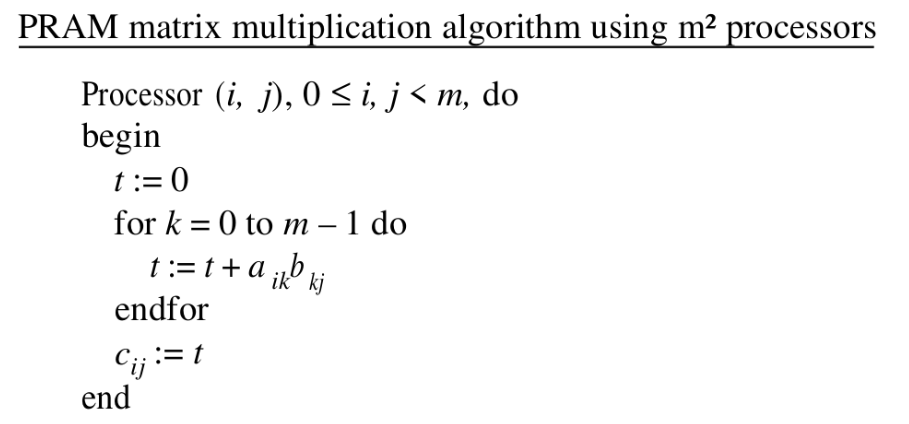
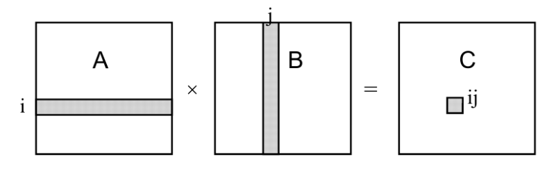
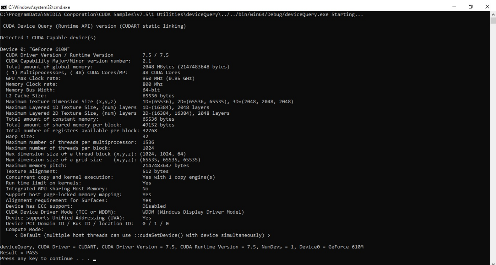

# Parallel-Fast-Matrix-Multiplication

My first project was in the "Parallel Processing" course when I was in the 2nd semester of my master's at SUT. In this project I implemented a fast parallel matrix multiplication form Parhami's book with CUDA. 

## Parhami's Algorithm
|  | 
|:--:| 
| *fast matrix multiplication* |

## EREW PRAM
|  | 
|:--:| 

## GPU Configuration
|  | 
|:--:| 
