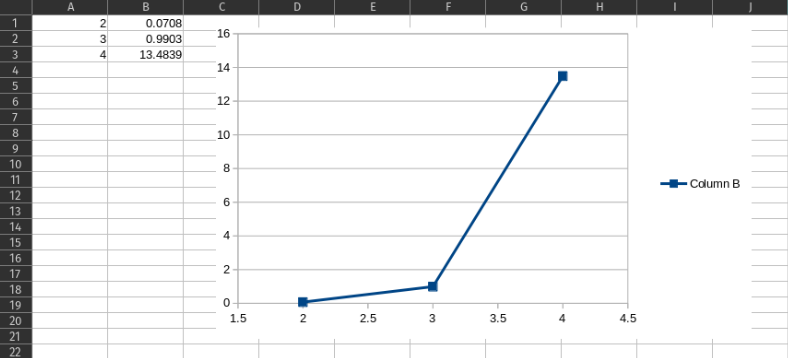

# Parallel-Jacobi-Method

My 2nd project was in the "Parallel Processing" course when I was in the 2nd semester of my master's at SUT. In this project I implemented a multicore version of Jacobi Algorithm with OpenMP. 

## CPU Configuration
|  | 
|:--:| 

## A sample Output
|  | 
|:--:| 

## Performance Analysis with ‫‪Intel‬‬ ‫‪Vtune‬‬ ‫‪Profiler‬‬

|  | 
|:--:| 
|*part One*|

|  | 
|:--:| 
|*part Two*|

## Run-time Abalysis

In the following figure, you can see the run-time results of this program by 2, 3, and 4 threads on 10 input size data.

|  | 
|:--:| 

In the following figure, you can see the run-time results of this program by 2, 3, and 4 threads on ‫‪10000‬‬ input size data.

|  | 
|:--:| 
